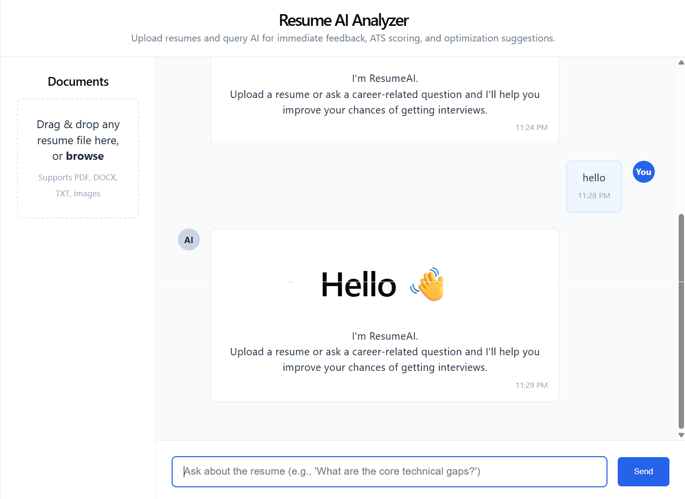
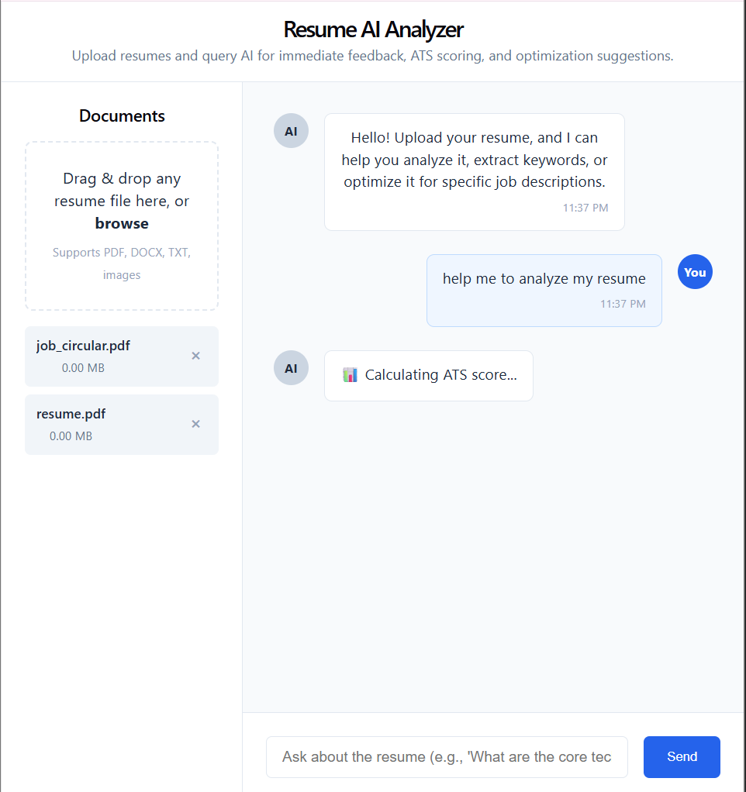
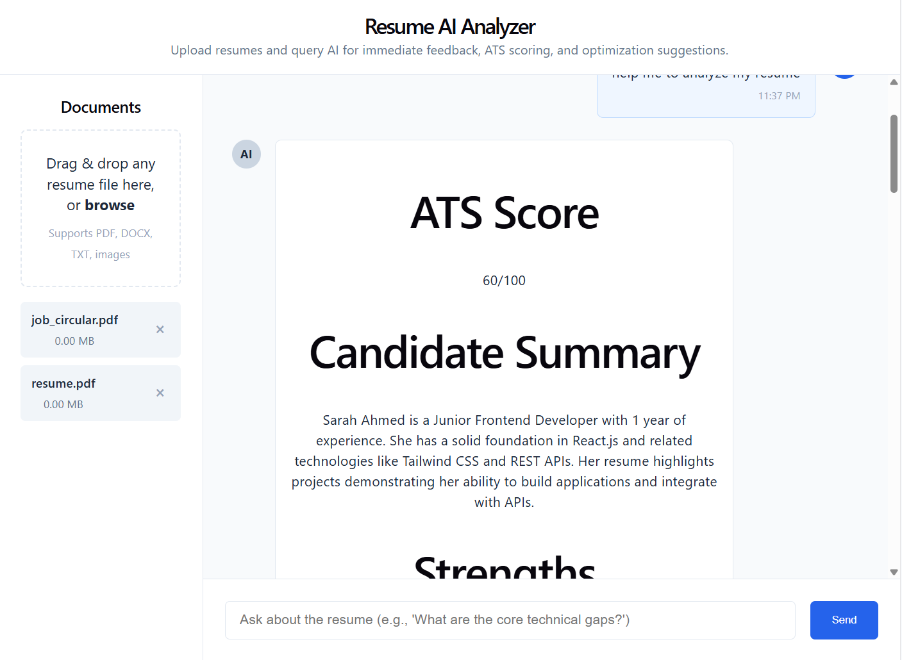

# 🚀 ResumeAI Analyzer

An AI-powered resume analysis platform that helps users evaluate resumes, identify skill gaps, improve ATS scores, and receive personalized career guidance.

---

## ✨ Features

### 📄 Resume Upload

* Upload one or multiple PDF resumes
* Extracts text automatically
* Stores documents in MongoDB

### 🤖 AI Resume Analysis

* ATS Score Generation
* Strengths & Weaknesses Analysis
* Missing Skills Detection
* Recruiter Feedback
* Interview Readiness Assessment

### 💬 Context-Aware AI Chat

Ask follow-up questions like:

* What should I improve?
* What skills should I learn next?
* Which projects should I build?
* Why is my ATS score low?

The AI uses uploaded resumes as context for personalized answers.

### 📊 Structured Responses

* Markdown-based formatting
* ATS Scores
* Skill Gap Analysis
* Career Roadmaps
* Actionable Recommendations

### 🔄 Live Analysis Status

Displays real-time processing steps:

* 📄 Reading documents
* 🔍 Extracting skills
* 📊 Calculating ATS score
* 🎯 Matching requirements
* 🤖 Generating recommendations

### 🗑️ Smart Document Management

* Delete uploaded files
* Automatically removes associated MongoDB records
* Keeps frontend and backend synchronized

---

## 🛠️ Tech Stack

### Frontend

* React
* React Markdown
* CSS

### Backend

* Node.js
* Express.js
* Multer

### Database

* MongoDB Atlas
* Mongoose

### AI

* OpenRouter API
* Large Language Models

### Document Processing

* PDF Parse

---

## 🏗️ How It Works

```text
Upload Resume
      ↓
PDF Parsing
      ↓
MongoDB Storage
      ↓
AI Context Retrieval
      ↓
Resume Analysis
      ↓
ATS Score & Recommendations
```

---

## 🚀 Future Improvements

* Resume vs Job Description Matching
* Authentication & User Profiles
* Cover Letter Generator
* AI Mock Interviews
* Vector Database & RAG Integration

---

## 👨‍💻 Author

Built with React, Express, MongoDB, and AI to help job seekers improve their resumes and increase interview opportunities.
